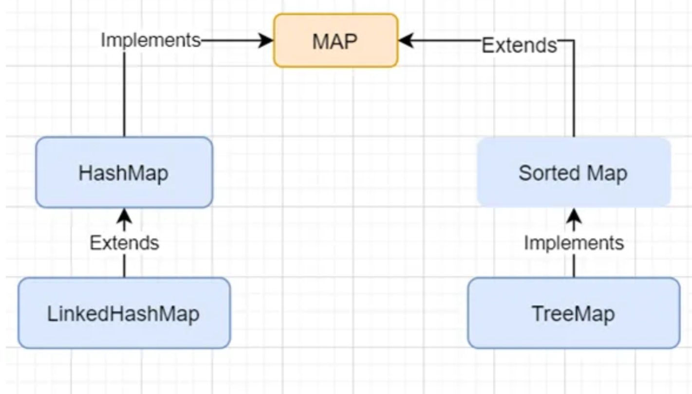
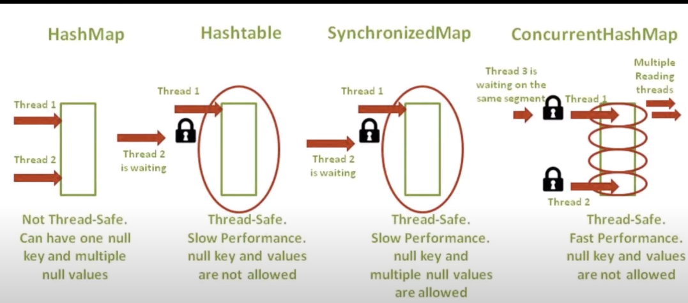

<h3> Applications of Hashing </h3>

* Bloom Filter is one of Famous Probabilistic Data Structure (Implemented with BitMap) uses Hashing.
* Image Processing, Block Chain, Network routing Etc..

Both HashMap and Hashtable provide similar functionality, but there are important differences between them, such as thread-safety, and the use of null keys and values, which make HashMap a more commonly used choice in modern Java applications. Hashtable is considered a legacy class and is generally not recommended for new development due to its synchronization overhead and other limitations.





<h2> HashMap Internal Implementation </h2>

From JDK8, HashMap uses <b> Balanceed Binary Tree </b> for Handling Collision Instead of Linked List after
Threshold of 8 Values. (This will Reduce Search from O(N) to O(logN) if many keys are stored at Same Index)

This is How Balanced Binary Tree Implemented (https://opendsa-server.cs.vt.edu/ODSA/Books/Everything/html/BSTDict.html)

* HashMap Can Contain Null Keys, (Hash Code would be zero, Hence Index would be 0).
* If a Key already Exists in HashMap, the value is replaced with new Value.

Other Collision Handling Techniques are : (Open Addressing -> Linear & Quadratic Probing, Double Hashing). However, Chaining gives more predictable and efficient outcomes.

<h2> Tips & Tricks </h2>

* Different Ways to Iterate over HashMap in Java
    * By using KeySet and Iterator
    * By using entrySet and Iterator
    * By using entrySet and Enhanced for Loop
    * By using KeySet and get() Method

<h2> Points for Interview </h2>

* HashMap Represents HashTable DataStructure.
* An Object Should Implement HashCode and Equlas() Method to be used as Key or Value in HashMap.
* Default Capacity for HashMap is 16, If nothing is Specified.


<h2> Different HashMap Implementations </h2>

* HashMap -> No Specified for Elements
* LinkedHashMap -> Elements are Sorted in the Way they are inserted.
<h4> If We require More Flexibility for Custom Sorting Method, SortedMap Interface is Better. However

* SortedMap is an interface in Java that extends the Map interface. It represents a map where the entries are stored in a sorted order based on the keys. It does not have a concrete implementation and is used as a contract for sorted maps.

    * The SortedMap interface provides methods for navigation and retrieval of elements in a sorted order, such as firstKey(), lastKey(), and subMap(). It also enforces that the keys are always sorted.

    * SortedMap allows for custom implementations, and it is often used when you need to provide your own sorting criteria or when you want to use a specific implementation of a sorted map.

Since SortedMap is Interface we can use Concrete Implementation such as TreeMap to Create Sorted Map with Custom Sorting.
Check More Here 

1. https://www.geeksforgeeks.org/sortedmap-java-examples/
2. https://jenkov.com/tutorials/java-collections/sortedmap.html
```
import java.util.Comparator;
import java.util.SortedMap;
import java.util.TreeMap;

public class CustomSortedMapExample {
    public static void main(String[] args) {
        // Create a TreeMap with a custom comparator for reverse order
        SortedMap<Integer, String> customSortedMap = new TreeMap<>(
            new Comparator<Integer>() {
                @Override
                public int compare(Integer key1, Integer key2) {
                    // Custom sorting logic: Sort in reverse order
                    return key2.compareTo(key1);
                }
            }
        );
        // Add key-value pairs to the custom sorted map
        customSortedMap.put(3, "C");
        customSortedMap.put(1, "A");
        customSortedMap.put(2, "B");

        // Display the custom sorted map
        for (Integer key : customSortedMap.keySet()) {
            System.out.println(key + ": " + customSortedMap.get(key));
        }
    }
}
```
* TreeMap is a specific implementation of the SortedMap interface. It uses a Red-Black Tree as the underlying data structure to maintain the keys in sorted order. This means that the keys are automatically sorted and balanced as you add or remove entries.
    * TreeMap is known for its efficient performance in terms of retrieval, insertion, and deletion operations. It provides guaranteed log(n) time complexity for these operations, where 'n' is the number of entries in the map.
    * TreeMap is often used when you need a map with keys sorted in natural order or based on a custom Comparator. It's particularly useful when you want to maintain a collection of elements in a specific order and efficiently perform range-based operations. ``