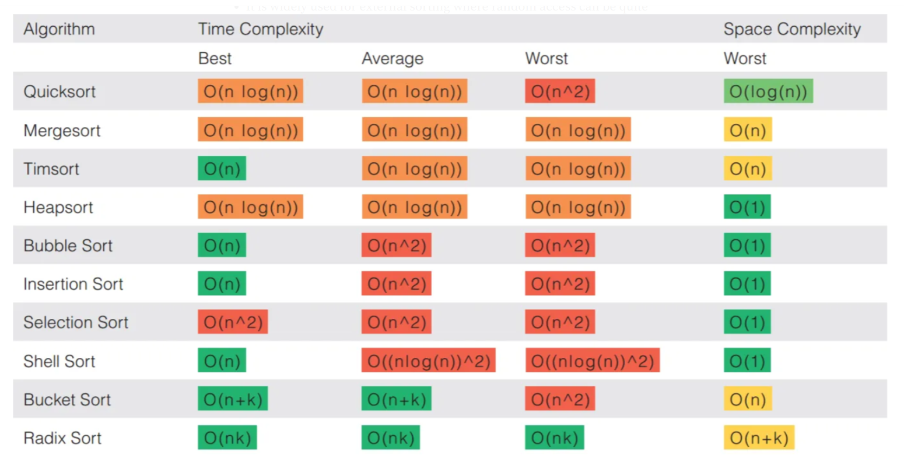

<h2> Sorting Algorithms Comparison </h2>

<b> Stable Sorting Algorithms </b> Maintains the Relative Order of Elements When there is a Tie(i.e. If Values are Same)
| Algorithms        |         Property         |
| ------------- | --------------------- |
| Bubble Sort, Insertion Sort, Merge Sort,Counting Sort | Stable     |
| Quick Sort, Selection Sort, Heap Sort      | Unstable           |

<b> Adaptive Sorting Algorithms </b> checks if the array is sorted already after each pass, breaks . Thus, They are efficient.
| Algorithms        |         Property         |
| ------------- | --------------------- |
| Bubble Sort, Insertion Sort, Quick Sort  | Adaptive     |
| Selection Sort, Merge Sort, Heap Sort      | Not Adaptive    |

<b> Online Sorting Algorithms </b> online sorting algorithms handle situations where data arrives sequentially or when the entire dataset cannot fit into memory. (They Sort Data as in When They Arrive).
<b> Offline sorting algorithms </b> operate on the entire dataset, assuming that all the data is available in memory.
| Algorithms        |         Property         |
| ------------- | --------------------- |
| Selection Sort, Bubble Sort, Merge Sort, Quick Sort  | Offline     |
| Insertion Sort, Heap Sort , Count Sort   | Online    |

## Sorting Algorithm Time Complexities

| Algorithm          | Best Case  | Average Case | Worst Case |
|--------------------|------------|--------------|------------|
| **Bubble Sort**    | O(n)       | O(n^2)       | O(n^2)     |
| **Selection Sort** | O(n^2)     | O(n^2)       | O(n^2)     |
| **Insertion Sort** | O(n)       | O(n^2)       | O(n^2)     |
| **Merge Sort**     | O(n log n) | O(n log n)   | O(n log n) |
| **Quick Sort**     | O(n log n) | O(n log n)   | O(n^2)     |
| **Heap Sort**      | O(n log n) | O(n log n)   | O(n log n) |

These are the time complexities for common sorting algorithms. Understanding these complexities helps in choosing the right sorting algorithm for your specific needs.

<h2> Selection Sort </h2>

* Selection sort is a sorting algorithm that selects the Smallest/Greatest element from an unsorted list in each iteration and places that element at the beginning of the unsorted list.

* Selection sort has various real-world applications, especially in scenarios where simplicity is preferred over performance, or the dataset is relatively small. Here are some real-world examples:

    * Sorting a list of students by their grades or names in a small class.
    * Organizing files in a directory by their creation date or size.
    * Sorting a deck of cards in ascending or descending order.
    *  Arranging a list of items by price in a small e-commerce store.

<h2> Bubble Sort </h2>

* Bubble sort is a sorting algorithm that compares two adjacent elements and swaps them until they are in the intended order.
* Bubble sort is Mostly used for educational Purposes and Teaching.

<h2> Insertion Sort </h2>

* We can not get any results (such as smallest or Largest unlike bubble/ selection sort). 
* It works well for nearly sorted arrays.
* Insertion sort more operation intensive for arrays (If completely Unsorted), It is mainly developed to Sort LinkedList.
* It is Online Algorithm (Sorting can Occur as the data is received).

<h2> Merge Sort </h2>

* Worst case is also nlogn , hence works very well large datasets.
* Can be used to Sort LinkedList as well.
* But It fails for Small Size (n<=15) , Insertion sort performs well here. So we can use Insertion Sort as part of Merge Sort(Because Insertion sort is also stable,Can be used for LinkedLists. Though Bubble sort is stable, it can not be used for Linked-lists).

<h2> Quick Sort </h2>

* Though Quick Sort has The Worst Complexity of O(N^2), With Some Optimizations it can perform equivalent to Merge Sort.
* Since with Optimizations, In place Algo (does not require Space like Merge Sort) , It is internally Implemented as Default Sort in Most of the Languages.
* https://www.geeksforgeeks.org/quick-sort-vs-merge-sort/

<h1> Useful Resources </h1>

* https://atulkawasthi.medium.com/top-5-sorting-algorithms-built-in-function-in-programming-languages-which-sorting-internally-used-f1c1e3027ef4
